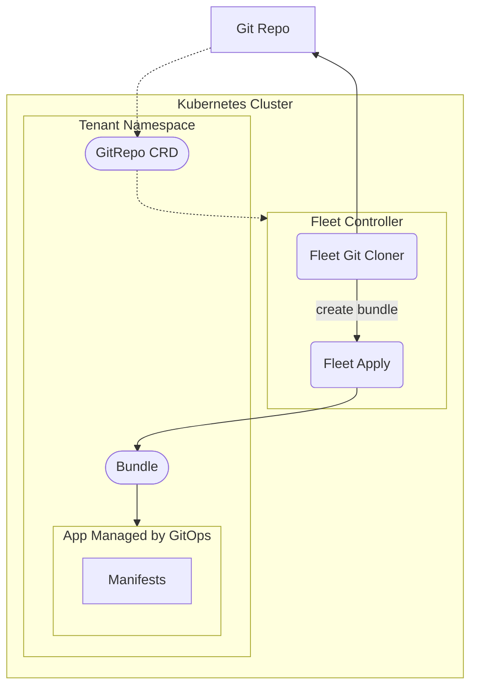

[Fleet](https://fleet.rancher.io/) by Rancher is a GitOps tool designed to manage large sets of Kubernetes clusters efficiently. In simple words, it can be used to take Kubernetes manifests from any Git repo & apply them to the cluster automatically. It can also manage Helm Charts, build Kustomize and even apply combinations of all 3. 

## Architecture

The diagram below is a simplification of what actually happens behind the scenes, see the [actual docs](https://fleet.rancher.io/0.9/architecture) for a more detailed description.



## Usage

To apply manifests from a repo, create a `GitRepo` CRD. You can do this either manually, or using the [Rancher Continuous Delivery Tab](https://rancher.konst.fish/dashboard/c/c-m-s44svljc/fleet).

```yaml
apiVersion: fleet.cattle.io/v1alpha1
kind: GitRepo
metadata:
  labels:
    tenant: <tenant>
  name: <project>
  namespace: fleet-<tenant>
spec:
  branch: main
  paths:
    - /path/to/manifests
  repo: https://github.com/user/repo
  targetNamespace: <tenant>
  targets:
    - clusterName: tetra
```

For more detailed examples on how to use Fleets full functionality, please see the [fleet-examples repo](https://github.com/rancher/fleet-examples). 