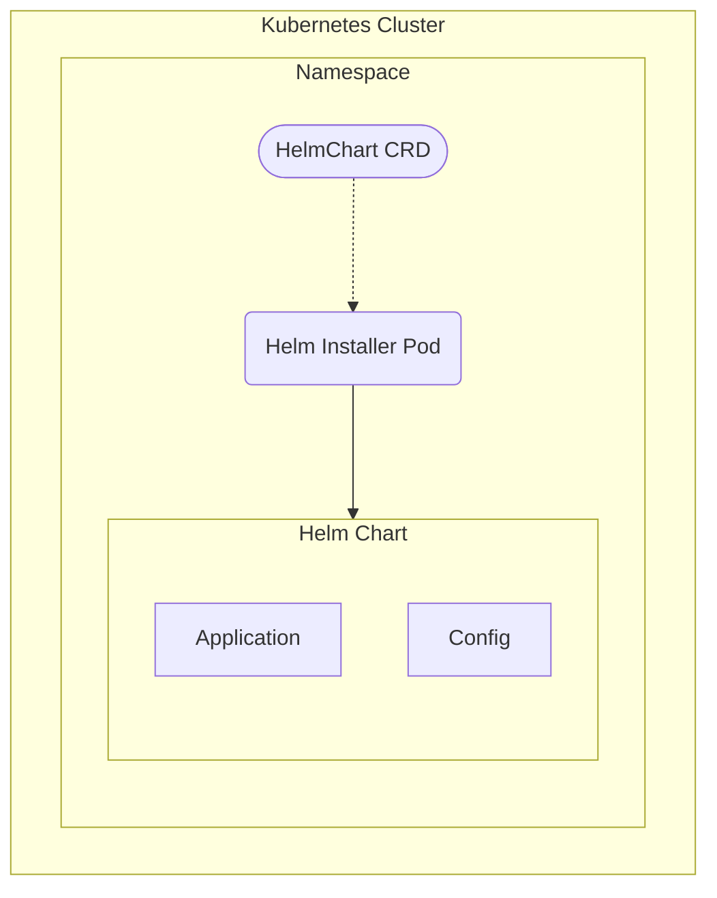

Rancher provides the ability to deploy [Helm Charts](https://helm.sh/docs/topics/charts/) using CRDs. `HelmChart` definitions contain the repository, chart, version & values, which are applied to the cluster by a temporary worker Pod. Any changes to the `HelmChart` CRD cause the creation of a new Pod to update the Chart in place.

## Architecture



## Usage

```yaml
apiVersion: helm.cattle.io/v1
kind: HelmChart
metadata:
  name: elasticsearch
  namespace: tenant
spec:
  # chart source
  chart: elasticsearch
  repo: https://helm.elastic.co
  version: v8.5.1
  targetNamespace: tenant
  # values
  set:
    rbac.create: "true"
  valuesContent: |-
    resources:
      requests:
        cpu: "1000m"
        memory: "2Gi"
      limits:
        cpu: "1000m"
        memory: "2Gi"
```