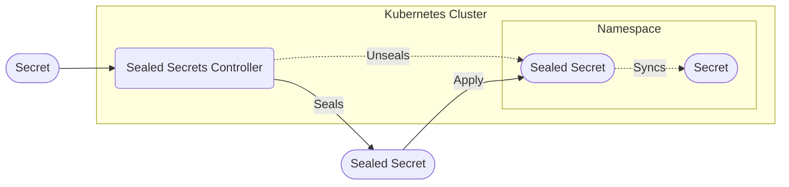

[Sealed Secrets](https://github.com/bitnami-labs/sealed-secrets) allow for Secrets to be stored along with other Manifests, even in public repositories. Sealed Secrets are encrypted & can only be decrypted by the Sealed Secrets Controller.

## Architecture

A regular secret can be encrypted with a public key held by the Sealed Secrets Controller. This returns a Sealed Secret, which can then be applied to the cluster again, where it is converted back into a regular secret.



## Usage

Install the kubeseal cli, either using `brew install kubeseal` or downloading it from the [releases](https://github.com/bitnami-labs/sealed-secrets/releases).

Take a regular secret such as

```yaml
apiVersion: v1
kind: Secret
metadata:
  name: examplesecret
type: Opaque
data:
  password: eHh4
```

& run kubeseal against it `kubeseal < secret.yaml -o yaml > sealed.yaml`

This results in a `SealedSecret`, which can be stored anywhere & is turned back into the original secret once applied to the cluster.

```yaml
apiVersion: bitnami.com/v1alpha1
kind: SealedSecret
metadata:
  creationTimestamp: null
  name: examplesecret
  namespace: tenant
spec:
  encryptedData:
    password: encrypted
  template:
    metadata:
      creationTimestamp: null
      name: examplesecret
      namespace: tenant
    type: Opaque
```