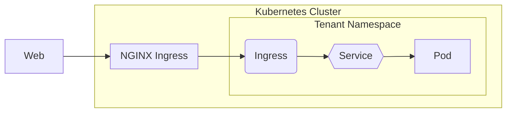

We're using the [Ingress NGINX Controller](https://github.com/kubernetes/ingress-nginx).

## Architecture



## Usage

The cluster offers a wildcard certificate for *.app.konst.fish records. Any of these can be claimed by tenants dynamically & overlap is explicitly prevented with a gatekeeper policy. Once a record has been claimed it only frees up once the initial ingress resource is deleted.

```yaml
apiVersion: networking.k8s.io/v1
kind: Ingress
metadata:
  name: example-ingress
spec:
  ingressClassName: nginx
  rules:
  - host: "example.app.konst.fish"
    http:
      paths:
      - pathType: Prefix
        path: "/"
        backend:
          service:
            name: example-service
            port:
              number: 3000
```

If you want to use a custom domain besides *.app.konst.fish see [[cert-manager]] to secure Ingresses with TLS & [[DNS]] to correctly point records to the cluster.
