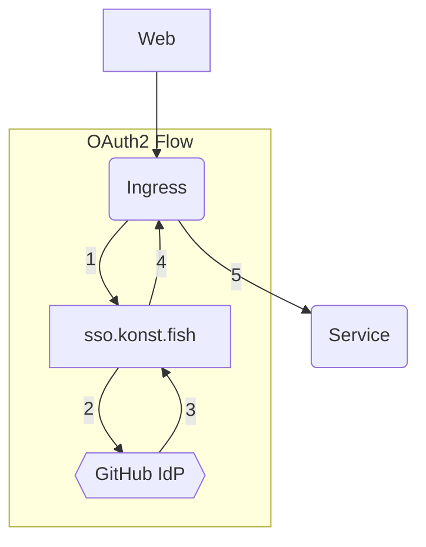

https://sso.konst.fish is an [OAuth2 Proxy](https://github.com/oauth2-proxy/oauth2-proxy) which authorizes any member of the [shoal-konst-fish GitHub Org](https://github.com/shoal-konst-fish).

## Architecture



## Usage

Add the following annotations to an ingress to use the proxy. All request made to the ingress will be secured by the proxy. The headers `X-Auth-Request-Email`, `X-Auth-Request-Groups` & `X-Auth-Request-User` are passed to the application, which can be used to identify and assign appropriate access levels to the user.

```yaml
apiVersion: networking.k8s.io/v1
kind: Ingress
metadata:
  name: ingress-behind-auth
  annotations:
    nginx.ingress.kubernetes.io/auth-signin: https://sso.konst.fish/oauth2/start?rd=$scheme://$host$request_uri
    nginx.ingress.kubernetes.io/auth-url: https://sso.konst.fish/oauth2/auth
    nginx.ingress.kubernetes.io/auth-response-headers: X-Auth-Request-Email,X-Auth-Request-Groups,X-Auth-Request-User
```