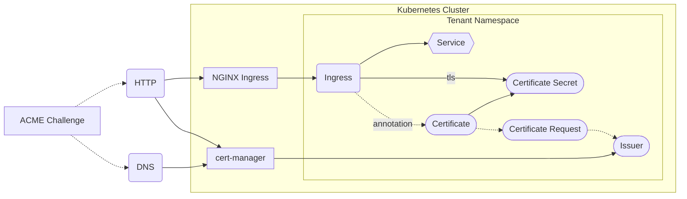

[cert-manager](https://cert-manager.io/) is a certificate controller for Kubernetes. It makes requesting certificates trivial and can be used simply through annotations.

## Architecture

cert-manager uses CRDs to handle the lifecycle of certificates. It listens for the creation of new `Certificate` objects, or specifically annotated Ingresses, which, once discovered, automatically get a `CertificateRequest` assigned. cert-manager handles the processing of the request, proving the ownership of the domain either through an HTTP or DNS [ACME Challenge](https://datatracker.ietf.org/doc/html/rfc8555) & then creates a `kubernetes.io/tls` Secret containing the resulting serving cert.


When using a custom Domain & Issuer:



## Usage

To use another domain besides `*.app.konst.fish`, create a CNAME record that points to the clusters canonical domain `app.konst.fish`. [[Ingress Nginx]] will then correctly route traffic originating from the custom domain. 

First create an [`Issuer`](https://cert-manager.io/docs/concepts/issuer/) CRD. These can be created for any challenge, the following example uses http. See a complete list of available solvers [here](https://cert-manager.io/docs/configuration/acme/). 

```yaml
apiVersion: cert-manager.io/v1
kind: Issuer
metadata:
  name: letsencrypt-<tenant>-http
  namespace: tenant
spec:
  acme:
    email: <tenant email>
    privateKeySecretRef:
      name: <sample-secret-name-this-can-be-anything>
    server: https://acme-v02.api.letsencrypt.org/directory
    solvers:
    - http01:
        ingress:
          class: nginx
          serviceType: ClusterIP
```

Once this issuer has been created, adjust the Ingress like the following.

```yaml
apiVersion: networking.k8s.io/v1
kind: Ingress
metadata:
  name: example-ingress
  annotations:
    cert-manager.io/issuer: "letsencrypt-<tenant>-http"
spec:
  ingressClassName: nginx
  tls:
  - hosts:
    - example.com
    secretName: example-tls # note, this can be any name, it's the secret cert-manager will use to populate the cert into
  rules:
  - host: "example.com"
```