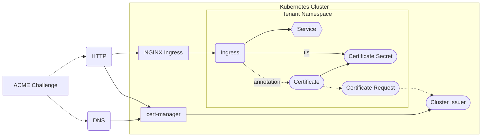

[cert-manager](https://cert-manager.io/) is a certificate controller for Kubernetes. It makes requesting certificates trivial and can be used simply through annotations.

## Architecture

cert-manager uses CRDs to handle the lifecycle of certificates. It listens for the creation of new `Certificate` objects, or specifically annotated Ingresses, which, once discovered, automatically get a `CertificateRequest` assigned. cert-manager handles the processing of the request, proving the ownership of the domain either through an HTTP or DNS [ACME Challenge](https://datatracker.ietf.org/doc/html/rfc8555) & then creates a `kubernetes.io/tls` Secret containing the resulting serving cert.



When using a custom Domain & Issuer:


## Usage

A simple Ingress using cert-manager looks like the following:

```yaml
apiVersion: networking.k8s.io/v1
kind: Ingress
metadata:
  name: example-ingress
  annotations:
    cert-manager.io/cluster-issuer: "appdomain"
spec:
  tls:
  - hosts:
    - example.appdomain.konst.fish
    secretName: example-tls # is automatically populated by cert-manager
  ingressClassName: nginx
  rules:
  - host: "example.appdomain.konst.fish"
    http:
      paths:
      - pathType: Prefix
        path: "/"
        backend:
          service:
            name: example-service
            port:
              number: 3000
```

To use a custom Issuer, which can be configured to handle DNS challenges, create an [`Issuer`](https://cert-manager.io/docs/concepts/issuer/) CRD.

```
apiVersion: cert-manager.io/v1
kind: Issuer
metadata:
  name: letsencrypt-http
  namespace: tenant
spec:
  acme:
    email: tenant-email@example.com
    privateKeySecretRef:
      name: appdomain
    server: https://acme-v02.api.letsencrypt.org/directory
    solvers:
    - http01:
        ingress:
          class: nginx
          serviceType: ClusterIP
```

See a complete list of available solvers [here](https://cert-manager.io/docs/configuration/acme/). To use a custom Issuer, adjust the Ingress like the following.

```yaml
apiVersion: networking.k8s.io/v1
kind: Ingress
metadata:
  name: example-ingress
  annotations:
    cert-manager.io/issuer: "letsencrypt-http"
```