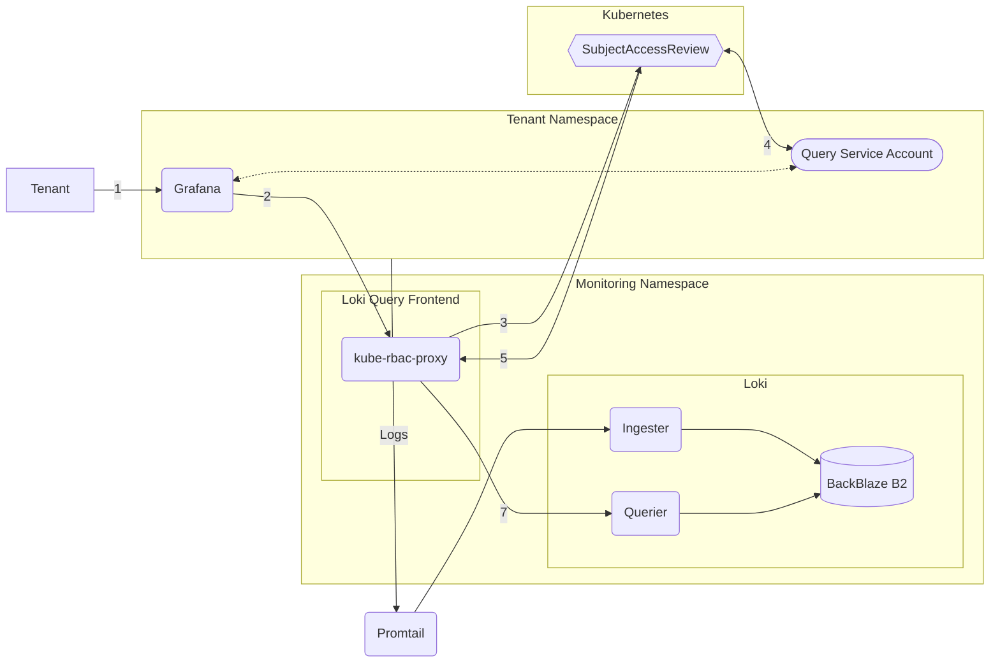

## Architecture

Built using the [Loki](https://artifacthub.io/packages/helm/grafana/loki) & [Promtail](https://artifacthub.io/packages/helm/grafana/promtail) Helm Charts. Logs are collected by Promtail Pods & [automatically assigned](https://grafana.com/docs/loki/latest/send-data/promtail/stages/tenant/) to a tenant based on the namespace. Tenants query Loki using their [OrgID](https://grafana.com/docs/loki/latest/operations/multi-tenancy/).

