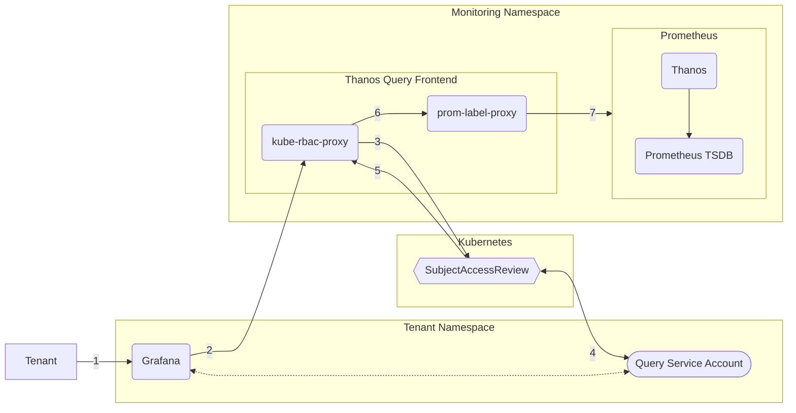

## Architecture

```mermaid
flowchart LR
    A[Tenant] -->|1| grafana(Grafana)
    subgraph Tenant Namespace
    qsa([Query Service Account]) <-.-> grafana
    end
    subgraph Monitoring Namespace
    subgraph Thanos Query Frontend
    grafana -->|2| krp(kube-rbac-proxy)
    krp -->|6| plp(prom-label-proxy)
    end
    plp -->|7| Prometheus
    subgraph Prometheus
    thanos(Thanos) --> prom(Prometheus TSDB)
    end
    end
    subgraph Kubernetes
    krp -->|3| sar{{SubjectAccessReview}}
    sar <-->|4| qsa
    sar -->|5| krp
    end
```