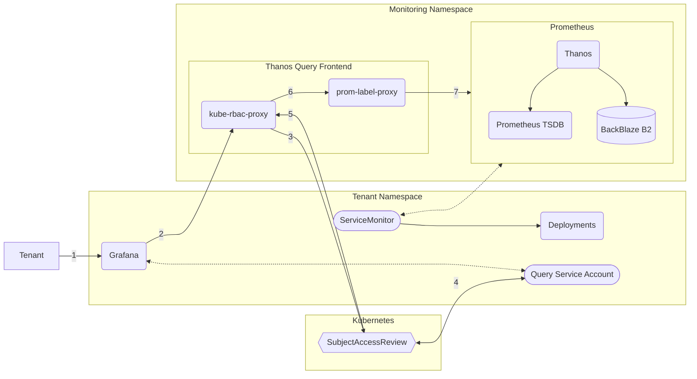

## Architecture

Built with the [Prometheus Operator](https://prometheus-operator.dev/). Metrics are [collected](https://medium.com/@helia.barroso/a-guide-to-service-discovery-with-prometheus-operator-how-to-use-pod-monitor-service-monitor-6a7e4e27b303) from every namespace by a Cluster Scope Prometheus Instance. High availibility is managed through [Thanos](https://thanos.io/). Tenants query metrics through central multi-tenancy enabled query endpoint built with [kube-rbac-proxy](https://github.com/brancz/kube-rbac-proxy) and [prom-label-proxy](https://github.com/prometheus-community/prom-label-proxy).



Metrics are stored within the Prometheus TSDB for 7 days. Thanos retains them for 30 days, then downsamples points to 5 minute intervals at before 60 days & 1 hour after.

## Usage

### Existing Metrics

Per default, the [kubelet](https://kubernetes.io/docs/reference/command-line-tools-reference/kubelet/) and [kube-state-metrics](https://github.com/kubernetes/kube-state-metrics) are collected cluster wide. These metrics give insight into cluster performance, Kubernetes resources & other related points.

### Generating Metrics

To feed metrics into Prometheus, use [`ServiceMonitors`](https://github.com/prometheus-operator/prometheus-operator/blob/main/Documentation/api.md#monitoring.coreos.com/v1.ServiceMonitor) to periodically scrape data from application exporter endpoints. 

```yaml
apiVersion: monitoring.coreos.com/v1
kind: ServiceMonitor
metadata:
  name: example-monitoring
spec:
  selector:
    matchLabels:
      # scrapes all services which match this label
      application: example
  endpoints:
      # on the monitoring port, every 30s
    - port: monitoring
      interval: 30s
```

There are a few other ways to achieve this, like [`PodMonitors`](https://github.com/prometheus-operator/prometheus-operator/blob/main/Documentation/api.md#podmonitor) or Annotations.

### Visualizing Metrics

Create a Service Account as described in [[Observability Usage]]. Then create a [[Grafana|Grafana Instance]] & a Prometheus `GrafanaDataSource`.

```yaml
apiVersion: grafana.integreatly.org/v1beta1
kind: GrafanaDatasource
metadata:
  name: metrics
  labels:
    app: grafana
spec:
  instanceSelector:
    matchLabels:
      app: grafana
  valuesFrom:
    - targetPath: secureJsonData.httpHeaderValue1
      valueFrom:
        secretKeyRef:
          key: token
          name: grafana-ds-sa-token
  datasource:
    name: metrics
    type: prometheus
    uid: prometheus1
    access: proxy
    url: "https://thanos-querier-frontend.monitoring.svc:9090/"
    isDefault: false
    editable: false
    jsonData:
      # set the query parameter to the correct namespace
      customQueryParameters: "namespace=<tenant>"
      # pass the Service Account JWT from the secret
      httpHeaderName1: Authorization
      httpMethod: GET
      manageAlerts: false
      queryTimeout: 5m
      timeInterval: 30s
      tlsSkipVerify: true
    secureJsonData:
      httpHeaderValue1: "Bearer ${token}"
```