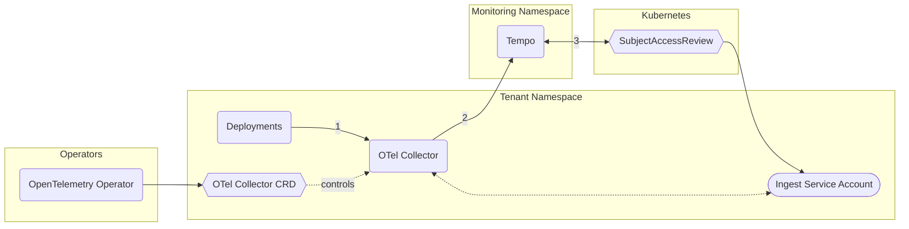

## Architecture

Tenants create Collectors using the [OpenTelemetry Operator](https://github.com/open-telemetry/opentelemetry-operator). todo expand



## Usage

Create a Service Account as described in [[Observability Usage]], but create a new role to allow *writing* metrics.

```yaml
apiVersion: rbac.authorization.k8s.io/v1
kind: Role
metadata:
  name: namespace-metrics-write
rules:
- apiGroups: [""]
  resources:
  - namespace/metrics
  verbs:
  - get
  - create
```

The example below is an elaborate OTel Collector setup which, in a addition to forwarding the traces, [dynamically creates Service Graph and Spanmetrics data](https://konst.fish/blog/OTel-Collector-SpanMetrics-Tempo).

```yaml
apiVersion: opentelemetry.io/v1beta1
kind: OpenTelemetryCollector
metadata:
  name: otel
spec:
  image: ghcr.io/open-telemetry/opentelemetry-collector-releases/opentelemetry-collector-contrib:0.100.0
  # expose the generated metrics
  ports:
    - name: http-metrics
      port: 8889

  # include service account token
  envFrom:
    - secretRef:
        name: otel-sa-token

  config:
    
    # trace-ingestion endpoints
    receivers:
      otlp:
        protocols:
          grpc: {}
          http: {}

    # create other data from traces
    connectors:
      servicegraph:
        latency_histogram_buckets: [100ms, 250ms, 1s, 5s, 10s]
      spanmetrics:
        namespace: traces.spanmetrics
        histogram:
          unit: "s" # important so that the histogram is correctly displayed in Grafana
        dimensions:
          - name: http.method
            default: GET
          - name: http.status_code
        exemplars:
          enabled: true
        events:
          enabled: true
          dimensions:
            - name: exception.type
            - name: exception.message
        resource_metrics_key_attributes:
          - service.name
          - telemetry.sdk.language
          - telemetry.sdk.name

    # forward traces
    exporters:
      otlphttp:
        # ingester frontend
        endpoint: https://tempo-ingester-frontend.monitoring.svc:4318
        tls:
          insecure_skip_verify: true
        # authenticate with service account token
        headers:
          X-Scope-OrgID: showcase
          Authorization: Bearer ${env:token}
      prometheus:
        endpoint: "0.0.0.0:8889"

    # processing pipelines
    processors:
      batch: {}

    service:
      pipelines:
        traces:
          receivers: [otlp]
          exporters: [otlphttp, spanmetrics, servicegraph]
          processors: [batch]
        metrics:
          receivers: [spanmetrics, servicegraph]
          exporters: [prometheus]
          processors: [batch]
```