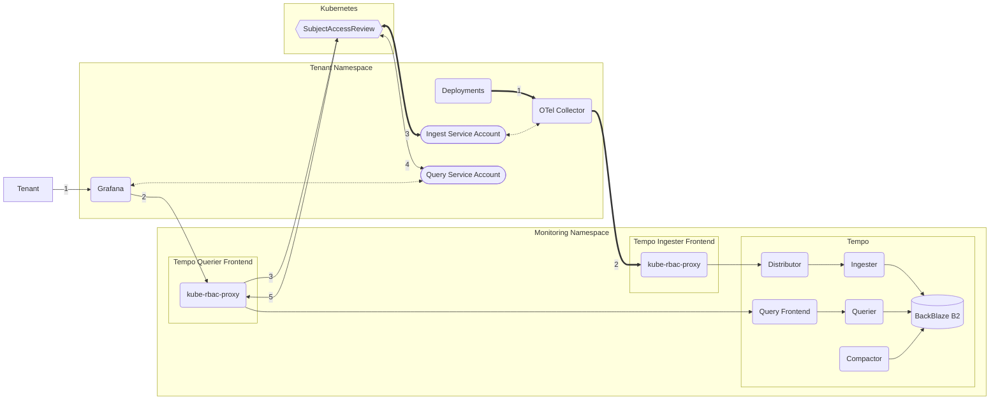

## Architecture

Multi-tenant [Tempo](https://grafana.com/oss/tempo/) Instance built with the [Tempo Operator](https://github.com/grafana/tempo-operator). Traces can be queried through the Querier Frontend, which is a [kube-rbac-proxy](https://github.com/brancz/kube-rbac-proxy). The Ingester frontend is built the same way, only allowing service account tokens from the correct namespace. see [[OpenTelemetry]] for more information on the [OTel Collector](https://opentelemetry.io/docs/collector/).



## Usage

### Collecting Traces

Please see the [[OpenTelemetry]] docs.

### Visualizing Traces

Create a Service Account as described in [[Observability Usage]]. Then create a [[Grafana|Grafana Instance]] & a Tempo `GrafanaDataSource`.

```yaml
apiVersion: grafana.integreatly.org/v1beta1
kind: GrafanaDatasource
metadata:
  name: traces
  labels:
    app: grafana
spec:
  instanceSelector:
    matchLabels:
      app: grafana
  valuesFrom:
    - targetPath: secureJsonData.httpHeaderValue1
      valueFrom:
        secretKeyRef:
          key: token
          name: grafana-ds-sa-token
  datasource:
    name: traces
    type: tempo
    uid: tempo1
    access: proxy
    url: "https://tempo-querier-frontend.monitoring.svc:3200/"
    isDefault: false
    editable: false
    jsonData:
      # pass the Service Account JWT from the secret
      httpHeaderName1: Authorization
      # & the namespace 
      httpHeaderName2: X-Scope-OrgID
      queryTimeout: 5m
      timeout: 60
      manageAlerts: false
      tlsSkipVerify: true
      # link the prometheus datasource
      nodeGraph:
        enabled: true
      serviceMap:
        datasourceUid: prometheus1
      tracesToMetrics:
        datasourceUid: prometheus1
    secureJsonData:
      httpHeaderValue1: "Bearer ${token}"
      httpHeaderValue2: "showcase"
```
