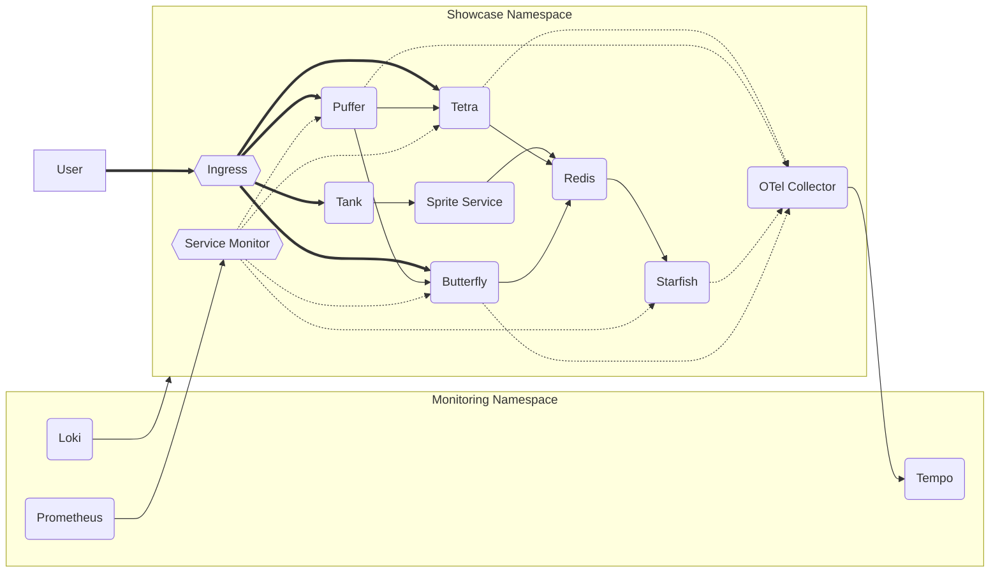

To demonstrate some cluster functionality, I set up a demo application with 4 microservices, a web server & a database/cache (Redis). 

The application can be accessed using the appdomain on https://aquarium.app.konst.fish/. ([Ingress Source](https://github.com/konstfish/aquarium/blob/main/kubernetes/ingress/ingress.yaml)) The source code & Kubernetes manifests are in this [git repo](https://github.com/konstfish/aquarium). 

The app also features complete observability, part of the platforms offered functionality, which can be viewed here https://showcase-grafana.app.konst.fish/ (This is behind [[Zero Trust]], all members of the GitHub Org are authorized)

## Architecture Graph

