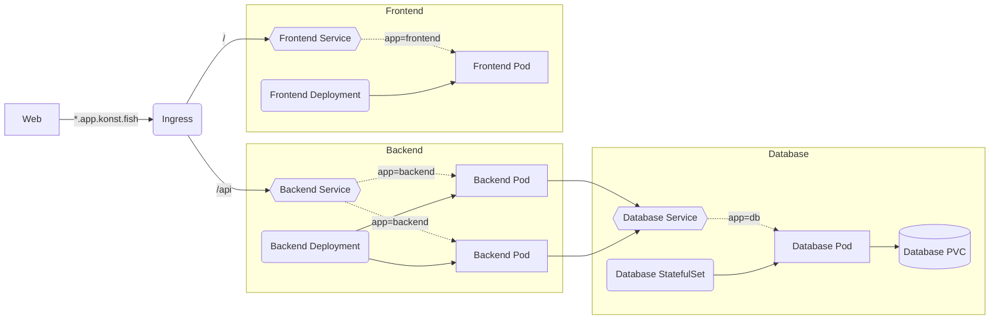

These manifests should help you get started with Kubernetes. For an applied example, see [[Showcase]].

## Kubernetes Structure

The diagram below represents a basic web application. An *Ingress* controls where traffic from the Internet is routed. Depending on the path, a *Service* is exposed, which selects *Pods*. The selection is made using *Labels* (represented as dotted lines.) *Deployments* control the *Pods*, which are wrappers for *Containers*. The *Backend Pods* communicate with the Database using the *Database Service*, which is discoverable from within the Backend Pods using DNS. The Database persists data using a *Persistent Volume Claim* (*PVC*).



## Kubernetes Manifests

### Deployment
```yaml
apiVersion: apps/v1
kind: Deployment
metadata:
  name: nginx-deployment
spec:
  selector:
    matchLabels:
      app: nginx
  replicas: 2
  template:
    metadata:
      labels:
        app: nginx
    spec:
      containers:
      - name: nginx-pod
        image: nginx:latest
        resources:
          limits:
            memory: "128Mi"
            cpu: "500m"
          requests:
            memory: "64Mi"
            cpu: "250m"
        ports:
        - containerPort: 80
```

### Service
```yaml
apiVersion: v1
kind: Service
metadata:
  name: nginx-service
spec:
  selector:
    app: nginx
  ports:
  - port: 80
    targetPort: 80

```

### Ingress

Also see [[Ingress Nginx]]

```yaml
apiVersion: networking.k8s.io/v1
kind: Ingress
metadata:
  name: nginx-ingress
  labels:
    name: nginx-ingress
  annotations:
    cert-manager.io/issuer: "appdomain"
spec:
  tls:
  - hosts:
    - test.app.konst.fish
    secretName: test-tls
  ingressClassName: nginx
  rules:
  - host: test.app.konst.fish
    http:
      paths:
      - pathType: Prefix
        path: "/"
        backend:
          service:
            name: nginx-service
            port: 
              number: 80
```

### Persistent Volume Claim (PVC)
```yaml
apiVersion: v1
kind: PersistentVolumeClaim
metadata:
  name: test-pvc
spec:
  accessModes:
    - ReadWriteOnce
  volumeMode: Filesystem
  resources:
    requests:
      storage: 10Gi
  storageClassName: hcloud-volumes
```